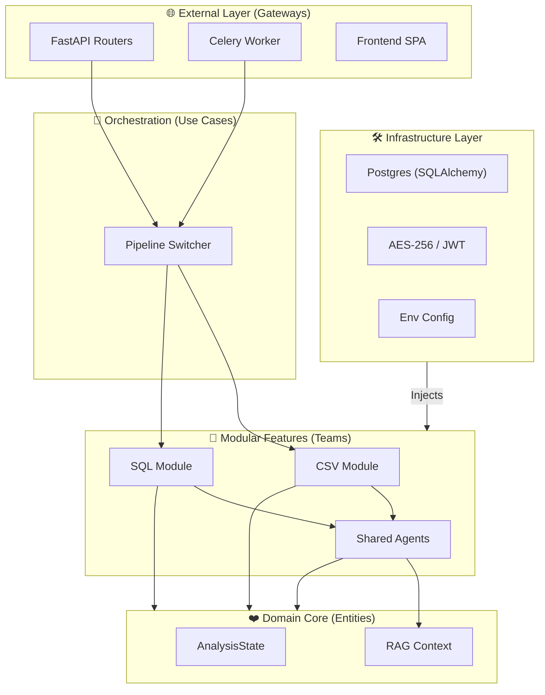
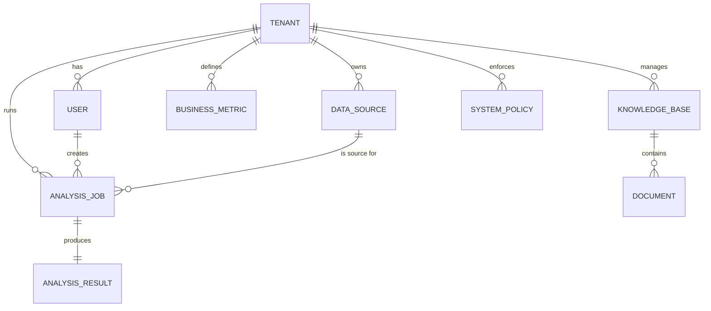

# 🏗️ System Architecture & Future Vision

This document provides a comprehensive technical breakdown of the Autonomous Data Analyst platform, from high-level layers to future AI roadmaps.

---

## 🛰️ 1. Layered Architecture (Onion Style)

We follow **Clean Architecture** to ensure that dependencies always point inward to the Domain.

### 🗄️ Database Entity Relationship (ERD) - RAG Expansion

---

## 📂 2. Folder Structure Breakdown

| Path | Purpose |
| :--- | :--- |
| **`app/domain`** | **Core Entities**: The single source of truth for the analysis state. |
| **`app/infrastructure`** | **Adapters**: DB connections, symmetric encryption, and middleware. |
| **`app/models`** | **ORM**: Database tables for Tenants, Users, and Jobs. |
| **`app/routers`** | **Gateways**: FastAPI endpoints for the frontend. |
| **`app/use_cases`** | **Orchestrators**: High-level logic that bridges modules. |
| **`app/modules`** | **Specialized Pipelines**: Isolated domains for CSV and SQL teams. |

---

## 🛡️ 3. Security & Isolation Guardrails

- **Module Isolation**: Teams are prohibited from importing code across modules. This is enforced by an automated "Isolation Guard" test in the CI.
- **SQL Shield**: A strict Regex-based filter blocks all queries that are not `SELECT` or `WITH`.
- **Credential Encryption**: External DB passwords are encrypted via AES-256 before being stored.
- **Execution Sandboxing**: Analysis code is executed in controlled environments with restricted permissions.

---

## 🧠 4. Future Roadmap: RAG & Advanced AI

The system is designed to evolve into a context-aware business brain using **Qdrant** (Vector DB).

### Key RAG Priorities:
1.  **Metric Dictionary**: Store definitions like "Active User" to prevent AI hallucinations.
2.  **Schema RAG**: Support databases with thousands of tables by retrieving only relevant column metadata.
3.  **Insight Memory**: Embed past `AnalysisResults` so the agent remembers previous findings.
4.  **Hybrid Context**: Merge structured data analysis with unstructured PDF knowledge (e.g., market research).

---

**This architecture ensures the project can scale to 100+ developers without the "Spaghetti Code" nightmare.**
