# C4 Architecture Diagrams

**Insightify — Autonomous Enterprise Data Intelligence Platform**

> C4 Model: four levels of zoom — Context → Container → Component → Code.
> Each diagram narrows scope. Start at Level 1 for the big picture.

---

## Level 1 — System Context

*Who uses the system, and what external systems does it interact with?*

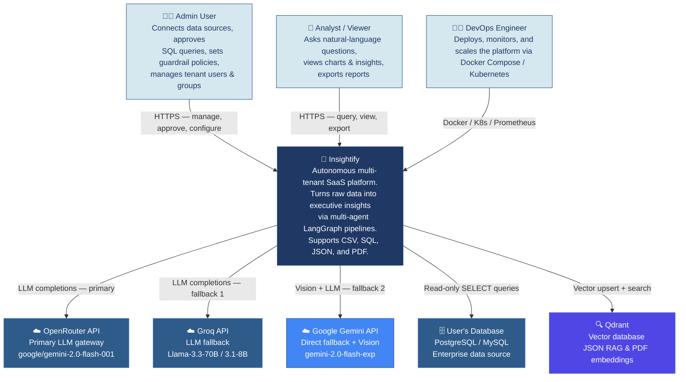

---

## Level 2 — Container Diagram

*What are the deployable units, and how do they communicate?*

```mermaid
graph TB
    User["👤 User / Admin"]

    subgraph Docker ["🐳 Docker Compose Network (22 services)"]
        UI["🖥️ Glassmorphism SPA
        Vanilla JS + ECharts/Plotly
        Served from api/app/static/"]

        ReactUI["⚛️ React + TypeScript SPA
        Vite · Component-based UI
        ECharts · frontend/"]

        API["🔀 API Gateway
        FastAPI · asyncpg · :8002
        JWT auth · AES-256-GCM encryption
        Rate limiting · Security headers
        Clean Architecture: domain/use_cases/infrastructure"]

        subgraph Workers ["⚙️ Celery Workers"]
            Gov["🛡️ Governance
            queue: governance
            2-node LangGraph: intake + guardrail"]

            SQL["🗃️ worker-sql
            queues: pillar.sql/.sqlite/.postgresql
            12-node Cyclic StateGraph
            HITL · Reflection · Hybrid Fusion · Semantic Cache"]

            CSV["📊 worker-csv
            queue: pillar.csv
            11-node Cyclic StateGraph
            Data Cleaning · Guardrail · Reflection"]

            JSON["📄 worker-json
            queue: pillar.json
            10-node Cyclic StateGraph
            MongoDB · Qdrant RAG"]

            PDF["📑 worker-pdf
            queue: pillar.pdf
            10-node Orchestrator StateGraph
            Gemini 2.0 Flash Vision · Triple-Engine"]

            Exp["📦 exporter
            queue: export
            PDF / XLSX / JSON report generation"]
        end

        subgraph Storage ["💾 Storage Layer"]
            PG["PostgreSQL :5433
            Tenants · Users · Jobs
            Results · Policies · Groups
            Insight Memory · Metrics"]

            Redis["Redis :6379
            Celery broker + result backend
            JWT JTI blacklist
            LangGraph HITL checkpoints
            Semantic cache"]

            QdrantLocal["Qdrant :6333
            JSON RAG vectors
            PDF chunk embeddings"]

            Vol["Shared Volume ./tenants/
            Uploaded CSV/JSON/PDF files
            Exported PDF/XLSX reports"]
        end

        subgraph Observability ["📈 Observability"]
            Prom["Prometheus :9090
            Metrics scraping"]
            Graf["Grafana :3000
            Pre-provisioned dashboards"]
        end
    end

    OpenRouter["☁️ OpenRouter API
    Gemini 2.0 Flash (primary)"]
    Groq["☁️ Groq API (fallback)"]
    GeminiAPI["☁️ Gemini Direct (fallback 2)"]

    User    -->|"HTTPS"| UI
    User    -->|"HTTPS"| ReactUI
    UI      -->|"fetch REST"| API
    ReactUI -->|"fetch REST"| API
    API     -->|"Celery task dispatch"| Redis
    Redis   -->|"task pickup"| Gov
    Gov     -->|"Celery task dispatch"| Redis
    Redis   -->|"task pickup"| SQL
    Redis   -->|"task pickup"| CSV
    Redis   -->|"task pickup"| JSON
    Redis   -->|"task pickup"| PDF
    Redis   -->|"task pickup"| Exp
    API     -->|"asyncpg SQL"| PG
    SQL     -->|"asyncpg SQL"| PG
    CSV     -->|"asyncpg SQL"| PG
    JSON    -->|"asyncpg SQL"| PG
    PDF     -->|"asyncpg SQL"| PG
    SQL     -->|"LangGraph HITL checkpoint"| Redis
    SQL     -->|"vector search (hybrid fusion)"| QdrantLocal
    JSON    -->|"vector search (RAG)"| QdrantLocal
    PDF     -->|"chunk indexing + search"| QdrantLocal
    API     -->|"file I/O"| Vol
    PDF     -->|"file I/O"| Vol
    Exp     -->|"report write"| Vol
    SQL     -->|"LLM calls"| OpenRouter
    CSV     -->|"LLM calls"| OpenRouter
    JSON    -->|"LLM calls"| OpenRouter
    PDF     -->|"Vision + LLM calls"| GeminiAPI
    Gov     -->|"LLM calls"| OpenRouter
    OpenRouter -->|"fallback"| Groq
    OpenRouter -->|"fallback"| GeminiAPI
    API     -->|"expose /metrics"| Prom
    Prom    -->|"data source"| Graf

    style API fill:#1F6B4E,color:#fff
    style Redis fill:#DC382D,color:#fff
    style PG fill:#336791,color:#fff
    style QdrantLocal fill:#4F46E5,color:#fff
    style Gov fill:#E74C3C,color:#fff
    style SQL fill:#27AE60,color:#fff
    style PDF fill:#4285F4,color:#fff
```

---

## Level 3 — Component Diagram: API Gateway

*What are the major components inside the API Gateway container?*

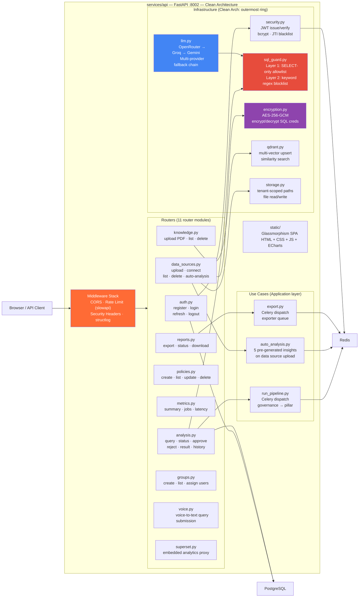

---

## Level 3 — Component Diagram: SQL Worker

*What are the 12 nodes inside the SQL analysis worker?*

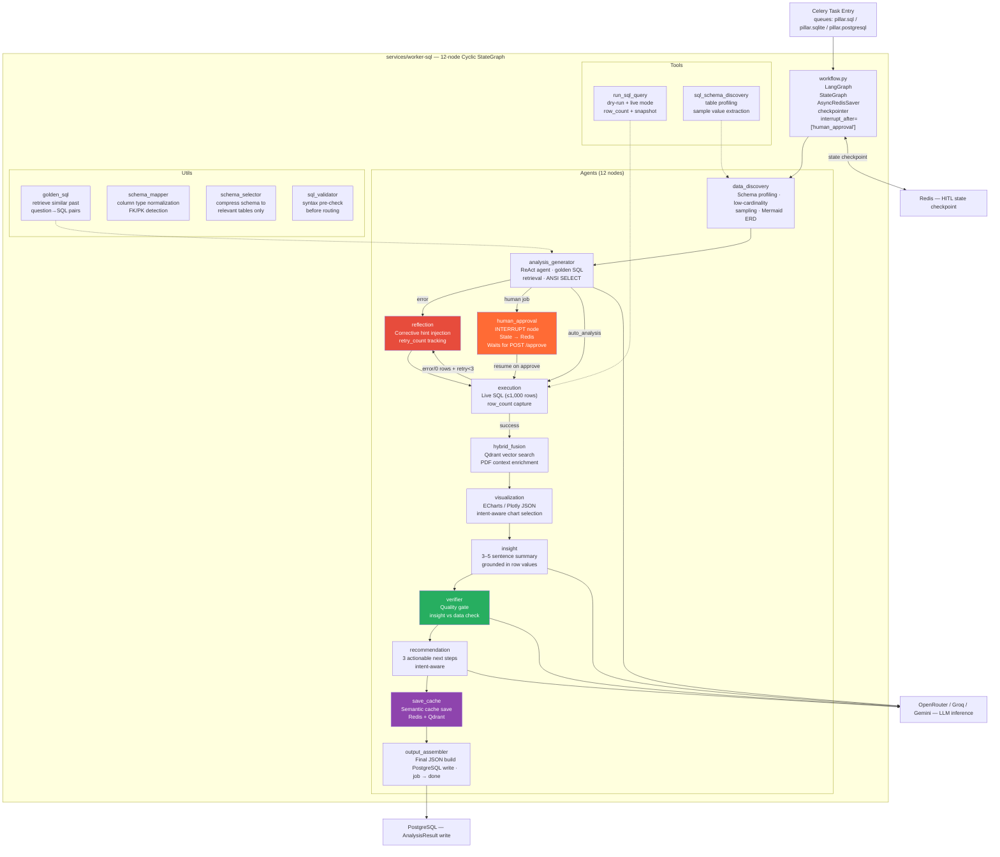

---

## Level 3 — Component Diagram: CSV Worker

*What are the 11 nodes inside the CSV analysis worker?*

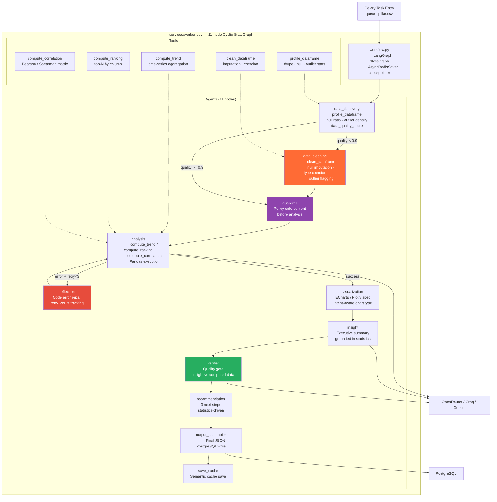

---

## Level 3 — Component Diagram: JSON Worker

*What are the 10 nodes inside the JSON analysis worker?*

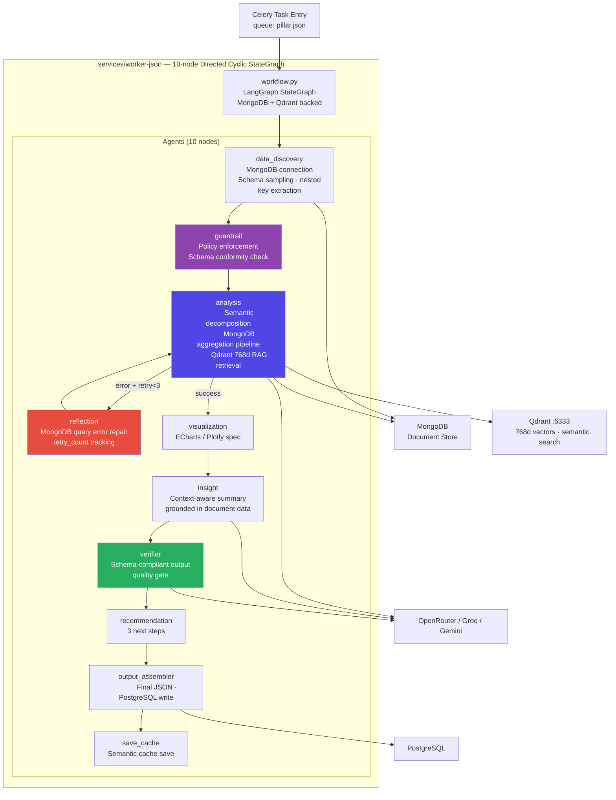

---

## Level 3 — Component Diagram: PDF Worker (Orchestrator)

*What are the 10 nodes inside the PDF Orchestrator worker?*

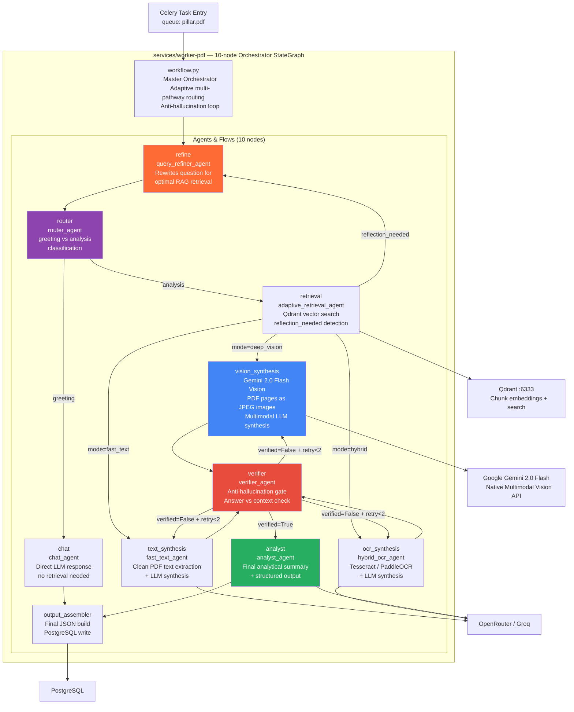

---

## Level 3 — Component Diagram: Governance Worker

*What are the components inside the Governance worker?*

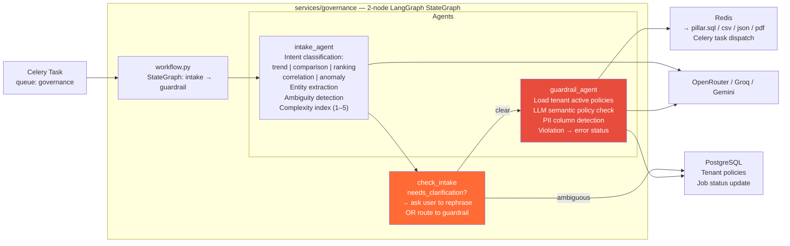

---

## Level 4 — Code Diagram: HITL Sequence

*How does Human-in-the-Loop approval work at the code level?*

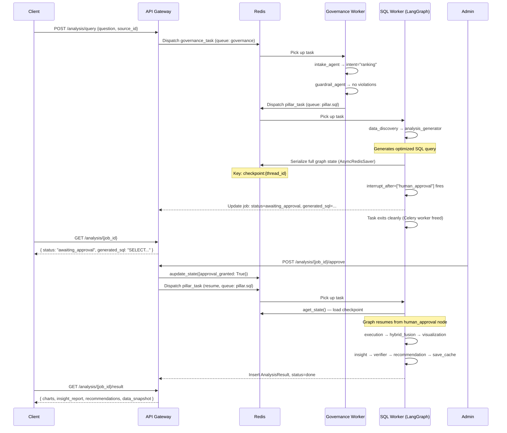

---

## Level 4 — Code Diagram: Zero-Row Reflection

*How does the SQL agent heal itself when a query returns no results?*

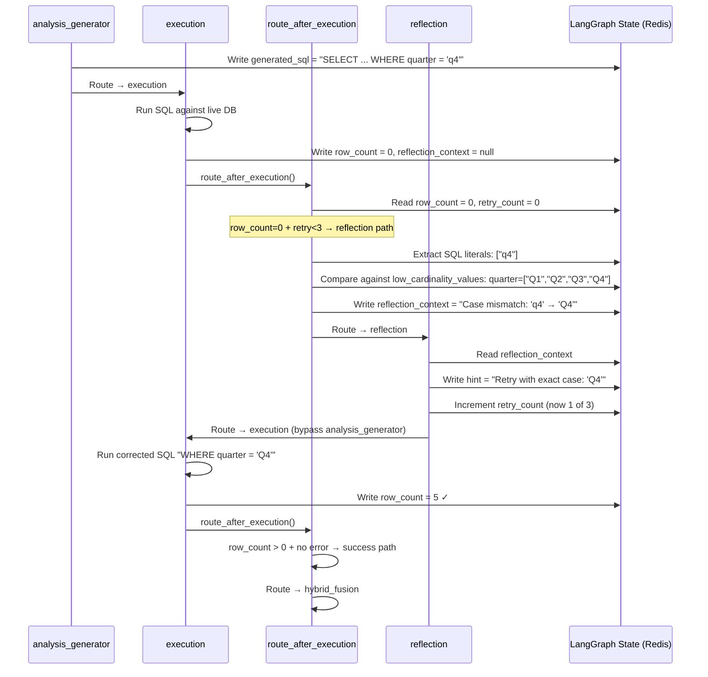

---

## Level 4 — Code Diagram: PDF Anti-Hallucination Loop

*How does the PDF worker verify its own answers?*

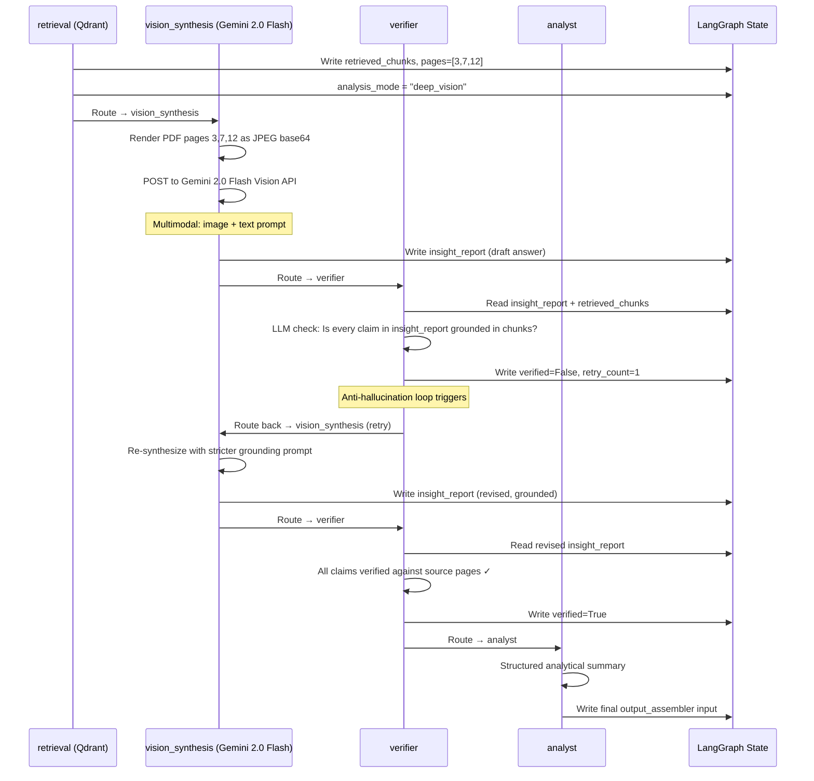

---

## Architecture Decision Records (ADR)

| Decision | Choice | Rejected Alternatives | Rationale |
|---|---|---|---|
| Inter-service communication | Celery + Redis queues | Direct HTTP, gRPC | Decoupling — API works even when workers are restarting |
| Service internal structure | Clean Architecture (Hexagonal) | MVC, flat scripts | Dependency Inversion: infrastructure changes don't touch domain logic |
| HITL state persistence | Redis (`AsyncRedisSaver`) | PostgreSQL, in-memory | Survives worker restart; Redis is already in the stack |
| LLM primary provider | OpenRouter (Gemini 2.0 Flash) | Groq Llama, OpenAI GPT-4 | Multimodal capability for PDF + cost efficiency + OpenRouter fallback routing |
| LLM fallback strategy | `with_fallbacks([Groq, Gemini Direct])` | Single provider, manual retry | Zero-downtime LLM provider outages; transparent to all agents |
| PDF synthesis | Gemini 2.0 Flash Vision (multimodal) | ColPali multi-vector, text chunking | Native multimodal: no separate embedding model; preserves visual layout, tables, charts |
| Vector search (JSON/PDF) | Qdrant (768d) | Pinecone, Weaviate, pgvector | Self-hosted; free; excellent async Python SDK; supports multi-vector |
| Credential encryption | AES-256-GCM in DB | AWS Secrets Manager, HashiCorp Vault | Zero external dependencies; clear migration path to secrets manager |
| Tenant isolation | Shared DB + `tenant_id` | One DB per tenant | Simpler ops at current scale; equivalent isolation guarantee via SQLAlchemy scoping |
| Frontend | Vanilla JS SPA + React/TS | Angular, Vue | Vanilla for zero-build-step demo; React for production component reuse |
| Observability | Prometheus + Grafana | Datadog, New Relic | Self-hosted; zero cost; provisioned automatically via Docker Compose |
| LangGraph graph type | `StateGraph` (Cyclic) | `MessageGraph`, linear chains | Cycles required for reflection loops, HITL, and anti-hallucination retries |
